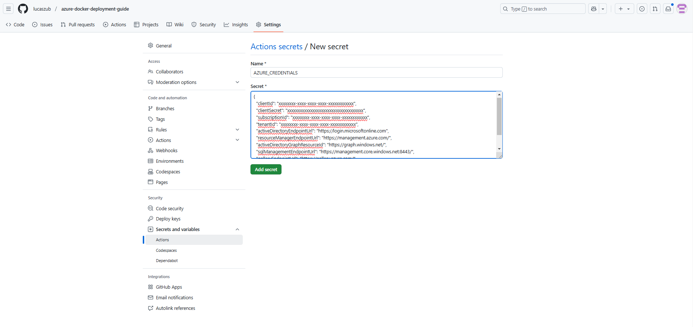

# Déploiement d'une application FastAPI sur Azure avec Azure CLI et GitHub Actions
Dans ce projet, nous allons déployer une application FastAPI sur Azure en utilisant Azure Container Registry (ACR) pour stocker l'image Docker et Azure Web App pour déployer l'application automatiquement via GitHub Actions.

Voici un guide pour y parvenir.
***
### Prérequis
- Un compte Azure actif.
- Docker installé sur votre machine.
- Azure CLI installé pour interagir avec les ressources Azure.
- Un compte GitHub avec des actions GitHub configurées pour automatiser le processus CI/CD.
*** 
## Étapes de Déploiement
### 1. Créer les ressources Azure via Azure CLI

**1.1 Créer un groupe de ressources**
D'abord, nous devons créer un **groupe de ressources** dans lequel nous allons stocker toutes les ressources Azure.

```bash
# Se connecter à Azure
az login

# Créer un groupe de ressources
az group create --name myResourceGroup --location francecentral
```
**1.2 Créer un Azure Container Registry (ACR)**
Le **Azure Container Registry (ACR)** permet de stocker l'image Docker pour que nous puissions la déployer sur une Web App Azure.
```bash
# Créer un Azure Container Registry (ACR)
az acr create --resource-group myResourceGroup --name weatherapplucasz --sku Basic
```
**1.3 Créer une Azure Web App**
Ensuite, nous devons créer une **Azure Web App** pour héberger notre application. Lors de la création de l'App Service, on configure l'image Docker pour qu'elle vienne de notre ACR.

```bash
# Créer un plan App Service
az appservice plan create --name myAppServicePlan --resource-group myResourceGroup --sku B1 --is-linux

# Créer une Web App en utilisant l'image Docker du ACR
az webapp create --name weatherapp --resource-group myResourceGroup --plan myAppServicePlan --deployment-container-image-name weatherapplucasz.azurecr.io/weatherapp:latest
```

## 2. Configurer Azure Web App pour pointer vers le bon container
Une fois la Web App créée, il faut configurer Azure pour qu'elle utilise l'image Docker de notre **ACR**. Cela se fait via le **portail Azure**.

- 1. Connecte-toi au **portail Azure**.
- 2. Va dans la section **App Services** et sélectionne ta Web App weatherapp.
- 3. Dans les paramètres, clique sur Configuration dans centre de déploiements
- 4. Dans la section Container settings, configure Azure Container Registry en pointant vers l'ACR que tu as créé (weatherapplucasz.azurecr.io).
- 5. Choisis l'image Docker correcte (weatherapp:latest).
Cela permettra à la Web App d'utiliser l'image la plus récente de ton ACR.


## 3. Créer les identifiants Azure pour GitHub Actions
Afin de déployer via GitHub Actions, nous devons utiliser des identifiants Azure. Tu peux obtenir ces identifiants avec la commande suivante :
```bash
az ad sp create-for-rbac --name "github-action-deploy" --role contributor --scopes /subscriptions/<subscription-id>/resourceGroups/myResourceGroup --sdk-auth

```
Cette commande génère un JSON contenant les informations nécessaires pour l'authentification. Par exemple :
```bash
{
  "clientId": "xxxxxxxx-xxxx-xxxx-xxxx-xxxxxxxxxxxx",
  "clientSecret": "xxxxxxxxxxxxxxxxxxxxxxxxxxxxxxxxxxxx",
  "subscriptionId": "xxxxxxxx-xxxx-xxxx-xxxx-xxxxxxxxxxxx",
  "tenantId": "xxxxxxxx-xxxx-xxxx-xxxx-xxxxxxxxxxxx",
  "activeDirectoryEndpointUrl": "https://login.microsoftonline.com",
  "resourceManagerEndpointUrl": "https://management.azure.com/",
  "activeDirectoryGraphResourceId": "https://graph.windows.net/",
  "sqlManagementEndpointUrl": "https://management.core.windows.net:8443/",
  "galleryEndpointUrl": "https://gallery.azure.com/",
  "managementEndpointUrl": "https://management.core.windows.net/"
}
```

## 4. Ajouter les identifiants Azure dans les secrets GitHub
Pour utiliser ces identifiants dans GitHub Actions, nous devons ajouter le JSON comme un secret dans ton dépôt GitHub.

- Va dans les Paramètres de ton dépôt GitHub.
- Clique sur Secrets puis New repository secret.
- Nom du secret : AZURE_CREDENTIALS
- Colle le JSON généré par la commande précédente dans la valeur du secret.
Cela permettra à GitHub Actions de s'authentifier auprès d'Azure pour déployer l'application.



## 5. Déploiement avec GitHub Actions
Une fois les secrets configurés, tu peux automatiser le déploiement avec GitHub Actions en utilisant le fichier .github/workflows/deploy.yml.

Voici un exemple de workflow GitHub Actions :
```YML
name: CI/CD Pipeline for FastAPI App

on:
  push:
    branches:
      - main

jobs:
  build_and_push:
    runs-on: ubuntu-latest

    steps:
      # Checkout le code source
      - name: Checkout code
        uses: actions/checkout@v2

      # Configuration de Docker
      - name: Set up Docker Buildx
        uses: docker/setup-buildx-action@v2

      # Log in to Azure CLI
      - name: Log in to Azure CLI
        uses: azure/login@v1
        with:
          creds: ${{ secrets.AZURE_CREDENTIALS }}

      # Log in to Azure Container Registry (ACR)
      - name: Log in to ACR
        run: |
          az acr login --name weatherapplucasz

      # Build Docker image
      - name: Build Docker image
        run: |
          docker build -t weatherapplucasz.azurecr.io/weatherapp:latest .

      # Push Docker image to ACR
      - name: Push Docker image to ACR
        run: |
          docker push weatherapplucasz.azurecr.io/weatherapp:latest

      # Déployer sur Azure Web App
      - name: Deploy to Azure Web App
        uses: azure/webapps-deploy@v2
        with:
          app-name: weatherapp
          images: weatherapplucasz.azurecr.io/weatherapp:latest

```

## Explication du workflow GitHub Actions
- **Checkout du code** : Le code source de ton projet est récupéré depuis ton dépôt GitHub.
- **Configuration Docker Buildx** : Prépare l'environnement Docker pour la construction d'images multi-architecture.
- **Login à Azure** : Utilise les informations d'identification stockées dans les secrets (AZURE_CREDENTIALS) pour se connecter à Azure.
- **Login à ACR** : Se connecte à ton Azure Container Registry pour pouvoir pousser l'image Docker.
- **Build de l'image Docker** : Crée l'image Docker de l'application FastAPI.
- **Push de l'image Docker vers ACR** : Envoie l'image Docker vers Azure Container Registry.
- **Déploiement sur Azure Web App** : Déploie l'image Docker depuis ACR vers Azure Web App.

Conclusion

Avec ces étapes, nous avons déployé une application **FastAPI** sur **Azure** en utilisant **Azure Container Registry (ACR)** pour stocker l'image Docker et **Azure Web App** pour le déploiement. Nous avons également configuré un pipeline CI/CD avec **GitHub Actions** pour automatiser le processus de build, de push et de déploiement.